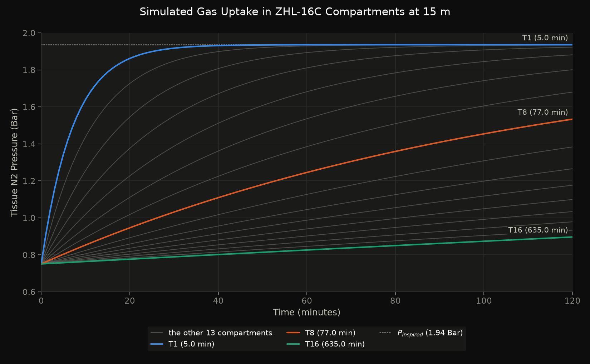
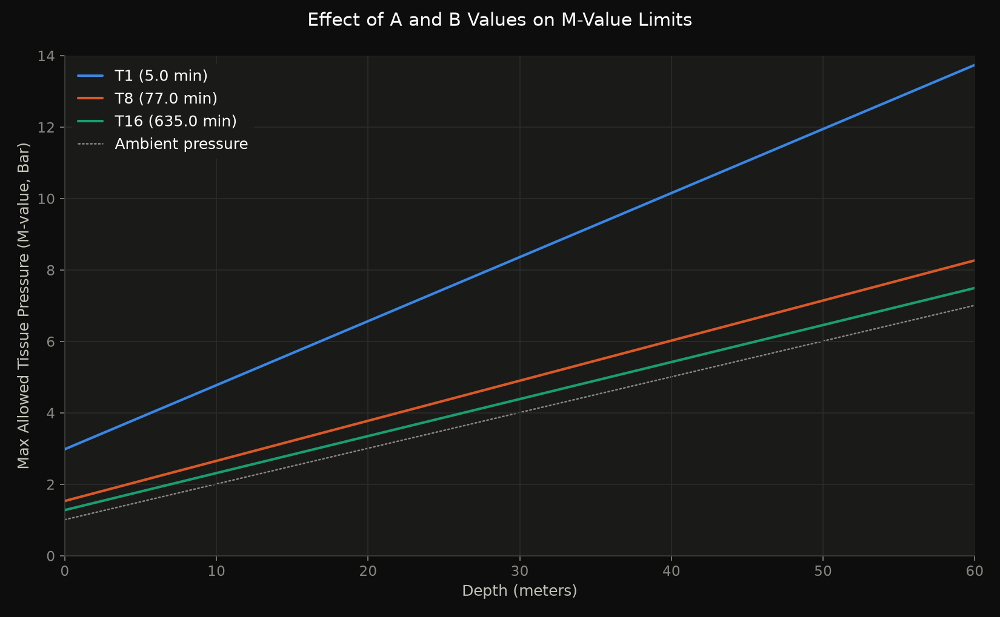
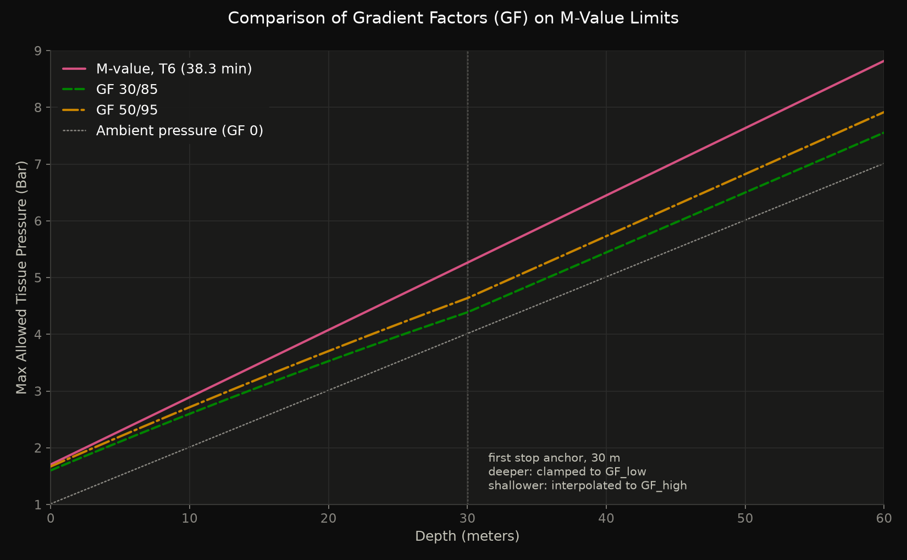
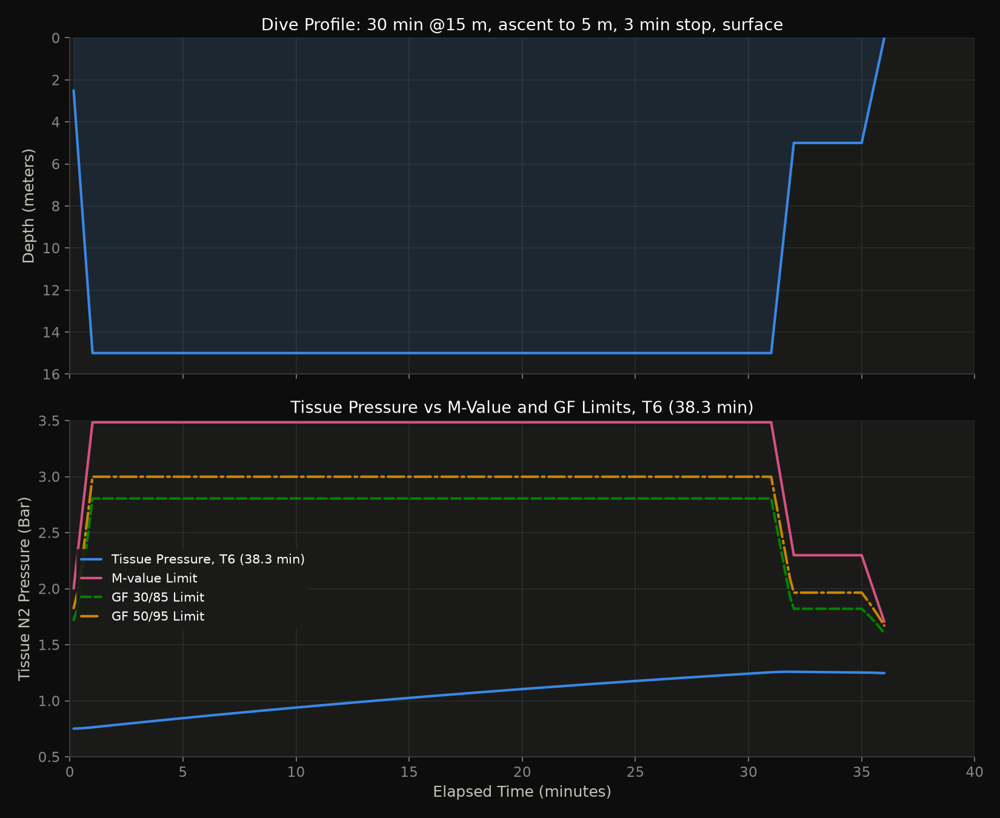
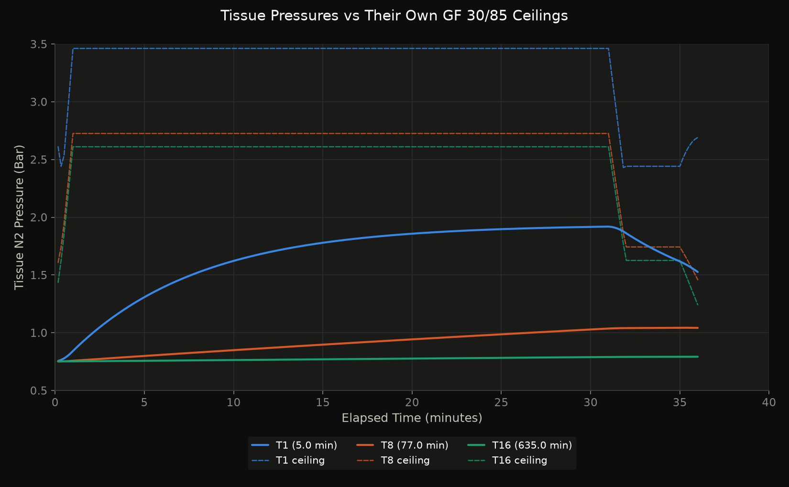

# `Bühlmann-Splinter` Decompression Algorithm

The `Bühlmann` decompression algorithm is a widely used model in scuba diving to calculate safe ascent profiles, based on inert gas (mainly nitrogen or helium) uptake and elimination in human tissues.

The algorithm was developed by `Dr. Albert A. Bühlmann`, a Swiss physician and researcher at the University of Zürich. His work led to a series of decompression models, culminating in the `ZHL-16` model, which uses 16 parallel tissue compartments with different half-times. These models form the basis of many modern dive computers and decompression tables used by recreational and technical divers.

The foundational research is described on:

> `Bühlmann, A. A.` (1983). [Decompression–Decompression Sickness](https://link.springer.com/book/10.1007/978-3-662-02409-6). Springer-Verlag, `ISBN: 978-3540127576`<br/>
> _`"Dekompression – Dekompressionskrankheit"`_

## Contents

- [Methodology](#methodology) — the model, its equations, its sea level reference, and a worked dive
- [Running the Code](#running-the-code) — requirements and project layout
- [Module A — Dive Profile Analyser](#module-a--dive-profile-analyser) — run a planned dive against the model
- [Module B — Altitude Analyser](#module-b--altitude-analyser) — flying or driving to altitude afterwards
- [Using the Model Directly](#using-the-model-directly) — driving it from Python
- [Regenerating the Report Graphs](#regenerating-the-report-graphs) — reproducing everything in `reports/`

## Methodology

How the model works, before how to run it. The four sections below are the
tissue table, the equations that drive it, the sea level reference they are all
measured against, and a worked example small enough to follow by hand.

### `ZHL-16` Tissue Compartment Table with Tissue Types

The `ZHL-16` tissue table lists 16 mathematical compartments that represent different types of _body tissues_ — each with its own half-time, and parameters `A` and `B` that determine its decompression limits.

> **Variant:** this implementation uses the **`ZHL-16C`** coefficients, the set most dive computers ship.
>
> `Bühlmann` published three. `ZHL-16A` is the original theoretical set, in which both coefficients fall straight out of the half-time — `a = 2 / ∛T` and `b = 1.005 − 1/√T`. It proved too permissive against real data, so he revised the mid and slow `A` values by hand, giving `ZHL-16B` for printed tables and `ZHL-16C` for dive computers. The `B` values were **never revised** and are identical in all three sets, which is the quickest way to spot a corrupted table.
>
> Both sets live in `src/configs/zhl16.py`, so changing variant really is the single edit that file claims. `16A` is materially more permissive — on a `30 m / 60 min` dive it asks for about a fifth less decompression.



> These compartments are not actual organs, but _conceptual_ models that simulate how inert gases (e.g. nitrogen or helium) are absorbed and released in different parts of the body at different rates.

| #  | Half-Time (in minutes)  | A-Value  | B-Value  | Tissue Type         | Notes       |
|----|-------------------------|----------|----------|---------------------|-------------|
| 1  | `5.0`                   | `1.1696` | `0.5578` | `Blood/Plasma`      | Very fast   |
| 2  | `8.0`                   | `1.0000` | `0.6514` | `Lungs`             | Fast        |
| 3  | `12.5`                  | `0.8618` | `0.7222` | `Skin`              |             |
| 4  | `18.5`                  | `0.7562` | `0.7825` | `Brain`             |             |
| 5  | `27.0`                  | `0.6200` | `0.8126` | `Muscle (active)`   |             |
| 6  | `38.3`                  | `0.5043` | `0.8434` | `Muscle (deep)`     |             |
| 7  | `54.3`                  | `0.4410` | `0.8693` | `Organs`            | Medium      |
| 8  | `77.0`                  | `0.4000` | `0.8910` | `Organs`            |             |
| 9  | `109.0`                 | `0.3750` | `0.9092` | `Fat (shallow)`     |             |
| 10 | `146.0`                 | `0.3500` | `0.9222` | `Fat (medium)`      |             |
| 11 | `187.0`                 | `0.3295` | `0.9319` | `Fat (deep)`        |             |
| 12 | `239.0`                 | `0.3065` | `0.9403` | `Bone (cancellous)` |             |
| 13 | `305.0`                 | `0.2835` | `0.9477` | `Bone (dense)`      | Slow        |
| 14 | `390.0`                 | `0.2610` | `0.9544` | `Bone`              |             |
| 15 | `498.0`                 | `0.2480` | `0.9602` | `Fat/Bone`          |             |
| 16 | `635.0`                 | `0.2327` | `0.9653` | `Fat/Bone`          | Very slow   |

- `Half-Time`: Time (in minutes) it takes the tissue to absorb or release **50%** of the inert gas difference
- `A-Value`: Intercept in the `M-value` equation — tolerance for supersaturation at **surface pressure**
- `B-Value`: Reciprocal of the slope in the `M-value` equation — `P_ambient` is **divided** by it, so a **lower** `B` means tolerance rises **faster** with depth
- `Tissue Type`: _Conceptual_ mapping to a body tissue (e.g. blood, muscle, fat, bone)
- `Notes`: Fast/slow behavior in decompression

#### `A` and `B` Values



They are used to calculate the `M-value`, the maximum safe inert gas pressure in a tissue:

- A (`intercept`): A constant that sets the baseline `supersaturation` limit for a tissue compartment at surface pressure
- B (`reciprocal slope`): `P_ambient` is **divided** by `B`, so a lower `B` makes the `M-value` climb more steeply with depth

> Together, they define the _ceiling_ for each tissue — i.e., how shallow the diver can go before needing a decompression stop.

| Tissue Type | Half-Time | A Value | B Value | Surfacing `M-value` | Behavior at Depth                                            |
| ----------- | --------- | ------- | ------- | ------------------- | ------------------------------------------------------------ |
| Fast        | Low       | High    | Low     | High (`2.99` bar)   | Loads and clears quickly; tolerates the most supersaturation |
| Slow        | High      | Low     | High    | Low (`1.28` bar)    | Loads slowly; tolerates the least supersaturation            |

<details><summary>fast tissues (e.g., half-time 5–18 minutes)</summary></br>

Fast Tissues present lower `B` values (e.g., `0.5578` to `0.78`). Because `P_ambient` is divided by `B`, their `M-value` climbs _faster_ with depth, and compartment 1 tolerates `2.99 bar` at the surface — the highest of the 16. They dominate the early part of an ascent because their short half-time loads them quickly, not because their limit is low.

</details>

<details><summary>slow tissues (e.g., 200–600+ minutes)</summary></br>

Slow Tissues present higher `B` values (e.g., `0.94` to `0.97`). Their `M-value` climbs _more slowly_ with depth and sits lowest at the surface (`1.28 bar` for compartment 16). They load slowly, but on long dives they become the limiting compartments and are what drive the long shallow stops.

</details>

### Mathematical Foundations

This section summarizes the core equations behind the `Bühlmann ZHL-16` decompression model, which simulates how inert gases (e.g., nitrogen or helium) are absorbed and eliminated from body tissues during a dive.

#### 1. Tissue Gas Uptake and Elimination

Each tissue compartment follows a first‑order exponential model for gas loading and off‑gassing:

$$
\Large P_{\text{tissue}}(t) = P_{\text{tissue}}(0) + \left( P_{\text{inspired}} - P_{\text{tissue}}(0) \right) \left( 1 - e^{-kt} \right)
$$

<details><summary>symbol definitions</summary></br>

Where:

- `P_tissue(t)`: inert gas pressure in the tissue after time `t`
- `P_tissue(0)`: initial tissue gas pressure
- `P_inspired`: inspired inert gas pressure at a given depth
- `k`: `ln(2) / half_time` - it defines how fast a tissue absorbs or releases inert gas
- `half_time`: tissue half‑time (in minutes)
- `t`: time at depth (in minutes)

This same equation is used for both:

- **On‑gassing** (when `P_inspired > P_tissue`)
- **Off‑gassing** (when `P_inspired < P_tissue`)

</details>

#### 2. Inspired Inert Gas Pressure

The inspired inert gas pressure is calculated from ambient pressure and gas fraction:

$$
\Large P_{\text{inspired}} = f_{\text{gas}} \cdot \left( P_{\text{ambient}} - P_{H_2O} \right)
$$

<details><summary>symbol definitions</summary></br>

Where:

- `gas_fraction`: fraction of inert gas (e.g. `0.79` for nitrogen in air)
- `P_ambient`: ambient pressure in bar (`1.01325 + depth / 10`)
- `P_H2O`: water vapor pressure in the lungs (`0.0627 bar`)

</details>

#### 3. `M‑Value` (Maximum Safe Tissue Pressure)

`Bühlmann` defined a maximum allowable inert gas pressure (`M‑value`) for each tissue compartment:

$$
\Large M = \frac{P_{\text{ambient}}}{B} + A
$$

<details><summary>symbol definitions</summary></br>

Where:

- `A`: tissue‑specific intercept (`ZHL16_A` value)
- `B`: tissue‑specific reciprocal slope (`ZHL16_B` value) — `P_ambient` is divided by it
- `P_ambient`: ambient pressure in bar
- `M`: maximum safe tissue pressure at that depth

> If the tissue pressure exceeds `M`, a decompression stop is required.

</details>

#### 4. Ascent Ceiling (Minimum Ambient Pressure)

To calculate the shallowest depth a diver can safely ascend to, the `M‑value` equation is rearranged:

$$
\Large P_{\text{ambient}}^{\min} = \left( P_{\text{tissue}} - A \right) \cdot B
$$

<details><summary>symbol definitions</summary></br>

Where:

- `P_tissue`: current inert gas pressure in the tissue
- `P_ambient_min`: minimum safe ambient pressure

This value defines the **decompression ceiling**.

</details>

#### 5. Gradient Factors

`Gradient Factors` add _conservatism_ by scaling down the `M‑value`:

$$
\Large P_{\text{allowed}} = P_{\text{ambient}} + GF \cdot \left( M - P_{\text{ambient}} \right)
$$

Since `GF` lies between `0` and `1`, the allowed pressure always falls **between** ambient pressure and the raw `M-value` — a gradient factor can only ever scale the allowance _down_. Its value is interpolated across the ascent, from `GF_low` at the first stop to `GF_high` at the surface:

$$
\Large GF = GF_{\text{high}} - \left( GF_{\text{high}} - GF_{\text{low}} \right) \cdot \frac{P_{\text{ambient}} - P_{\text{surface}}}{P_{\text{first stop}} - P_{\text{surface}}}
$$

<details><summary>symbol definitions and gradient factor pairs</summary></br>

`GF_low` and `GF_high` are two values that define how _conservative_ a decompression algorithm should be when calculating ascent ceilings and required stops.

Where:

- `GF`: gradient factor between 0 and 1
- `GF_low`: applied at the deepest decompression stop. Forces the diver to stop deeper and earlier; it helps control bubble formation when tissues are most saturated
- `GF_high`: applied near the surface. Controls how close tissue pressure can get to the `M-value` at surfacing

> Example: `GF_low` = 30 → only allows `30%` of the way to the full `Bühlmann` limit at the first deco stop.</br>
> Example: `GF_high` = 85 → allows `85%` of the full `Bühlmann` `M-value` as the final tissue ceiling at surfacing.



> This graph compares conservative (GF `30/85`) and less conservative (GF `50/95`) gradient factors, showing how each setting adjusts the safe tissue pressure ceiling below the `Bühlmann` `M-value` line across different depths. Both lines sit below the `M-value` at every depth and above ambient pressure, which is the `GF 0` floor drawn dotted. The kink at `30 m` is the first stop anchor: deeper than it the factor is clamped to `GF_low`, shallower it interpolates towards `GF_high`.

GF `100/100` allows surfacing as soon as no compartments exceed their raw `M-value` — it's efficient but higher risk if you're close to the limit.

| `GF_low` | `GF_high` | Description                         |
| -------- | --------- | ----------------------------------- |
| `30`     | `85`      | Conservative default (common)       |
| `50`     | `95`      | Moderately aggressive               |
| `100`    | `100`     | **Pure Bühlmann** — no conservatism |

The effect of using gradient factors versus pure `Bühlmann` in a recreational dives up to `30 meters` largely depends on how the dive is structured—particularly the bottom time and how the ascent is handled. For most `no-decompression` dives at this depth, the differences are usually _minimal_. If the diver ascends slowly and includes a standard safety stop, the added conservatism from gradient factors _often doesn’t significantly alter the outcome_. In these cases, tissue pressures typically remain well within safe limits, and both models would allow a clean ascent without requiring decompression stops.

The practical impact of GF only becomes noticeable in longer dives, more aggressive profiles, or when approaching decompression thresholds.

</details>

### The Sea Level Reference

Every pressure above is absolute, in bar, and every one of them is measured against a **sea level of `1.01325 bar`** — the published International Standard Atmosphere `P0` (`101325 Pa`), set once as `SURFACE_PRESSURE` in `src/configs/environment.py`.

That is worth stating because most diving literature rounds it to `1 bar`, and this project deliberately does not. The reason is the elevation conversion:

$$
\Large P(h) = P_0 \cdot \left( 1 - 2.25577 \times 10^{-5} \cdot h \right)^{5.25588}
$$

Those two constants are calibrated as a set with `P0 = 101325 Pa`. Keeping them while rounding `P0` to `1.0` gives a curve of the right _shape_ through the wrong _point_ — self-consistent, and wrong by about `110 m` at every elevation:

| Elevation | Rounded `P0 = 1.0` | `ISA P0 = 1.01325` |
| --------- | ------------------ | ------------------ |
| `0 m`     | `1.0000 bar`       | `1.0132 bar`       |
| `1,800 m` | `0.8042 bar`       | `0.8149 bar`       |
| `2,400 m` | `0.7464 bar`       | `0.7563 bar`       |

The middle column is a pressure that belongs to neither convention: it is `2,400 m` on the diving scale and `2,505 m` on the standard atmosphere. Since [Module B](#module-b--altitude-analyser) compares tissue pressures directly against these figures, the project uses the ISA value throughout so that a stated elevation means what it says.

The visible consequences are small and all of a piece — a sea level dive reports `1.0132 bar` rather than `1.0000 bar`, surface equilibrium is `0.7509 bar` rather than the `0.7405 bar` of the tables, and compartment 1's surfacing `M-value` is `2.99 bar` rather than the tabulated `2.96 bar`. Each is the same equation evaluated at a real sea level instead of a rounded one.

> The published `ZHL-16C` `A` and `B` coefficients are **unaffected**. They are properties of the algorithm, not of the atmosphere, and are used exactly as `Bühlmann` printed them.

### Simulating a Simple Dive

Here's how these formulas come together in a practical example of a typical dive simulation:

#### Dive Profile

- Descend to **15 meters** (ambient pressure `≈ 2.513 bar`)
- Stay at **15 meters** depth for **30 minutes**
- Ascend to **5 meters** and stay for **3 minutes**
- Surface (ambient pressure `≈ 1.013 bar`)

#### Step-by-Step Application

1. **Calculate inspired nitrogen pressure** at `15 meters`:
   - `P_ambient` = 1.01325 + (15 / 10) = `2.513 bar`
   - `P_inspired` = 0.79 × (2.513 − 0.0627) `≈ 1.936 bar`

2. **Update each tissue** using the gas loading formula for 30 minutes at 15m:
   - For each of the `16 compartments`:
     - Apply: `P_tissue(t) = P_tissue(0) + (P_inspired − P_tissue(0)) × (1 − e^(−k × t))`

3. **Ascend to `5 meters`**, recalculate `P_inspired`, and update tissue pressures again for `3 minutes`.

4. **Check each compartment** before surfacing:
   - Compute its `M-value`: `M = P_ambient / B + A`
   - Compare to the current `P_tissue`
   - If `P_tissue > M`, decompression stop is _required_

5. **(Optional)** Apply **Gradient Factors**:
   - Calculate a GF-adjusted limit: `P_allowed = P_ambient + GF × (M − P_ambient)`
   - This helps determine whether it's safe to surface under conservative settings like GF `30/85`

#### Result

The dive simulation models a straightforward profile: a descent to `15 meters` for `30 minutes`, followed by a direct ascent to `5 meters` with a `3-minute` safety stop, and then _surfacing_. The `fast` compartment is the one that visibly does the work — it loads to `1.92 bar` over the bottom phase and is already off-gassing by the safety stop, ending at `1.53 bar`. The `medium` and `slow` compartments are still filling when the diver surfaces; on a dive this short they barely turn over at all, peaking at `1.04` and `0.79 bar` respectively.



Using `Bühlmann’s` `ZHL-16` algorithm, the tissue pressure remains safely below the calculated `M-value` limit. Two sets of gradient factors (GF `30/85` and GF `50/95`) were applied to assess additional safety margins. The tissue pressure did not exceed either of these GF-adjusted ceilings at any point, indicating the diver stayed within conservative ascent limits.



> Each compartment is paired with **its own** `GF 30/85` ceiling, in the same colour. Drawing one compartment's ceiling across all three would compare a pressure against a limit that was never its own.

The absence of any threshold crossings suggests that no decompression stop was required, and the `3-minute` hold at `5 meters` was sufficient to manage `supersaturation` before surfacing. Overall, this profile represents a clean, `no-decompression` dive that adheres well to both standard and conservative ascent protocols.

## Running the Code

Two commands share one model and one state file. `profile_analyser` executes a
dive and writes the tissue state it ends on; `altitude_analyser` reads that
state and decides whether you can go up afterwards.

### Requirements

`Python 3.13`. Install the project and its test extras from the repository root:

```bash
pip install -e '.[test]'
```

### Project layout

Four layers, each depending only on the ones above it. The model knows nothing about files or command lines, which is what lets the same equations serve a dive profile and an altitude question.

```text
src/
  configs/     zhl16.py       the algorithm variant — half-times, A and B
               limits.py      conservatism — ascent rate, ppO2, gas mixes
               environment.py water and atmosphere — pressure conversions
  model/       splinter_decompression.py   pure ZHL-16C, no I/O
               atmosphere.py               elevation <-> pressure
               dive_state.py               tissue loading over time
  processors/  dive_analysis.py       execute a profile, judge it
               altitude_analysis.py   elevation change after a dive
               dive_simulation.py     synthetic profile generator
  utils/       profile_loader.py  read CSV/JSON dive logs
               state_store.py     tissue state between dives
               plotting.py        render a report
               cli.py             shared argparse validation
  handlers/    profile_analyser.py    the dive command
               altitude_analyser.py   the altitude command
references/    source material — the Bühlmann monograph
reports/       generated output — see Regenerating the report graphs
```

> **Pressure is the model's currency, not depth.** `load_gas_at_pressure` and `DiveState.step_at_pressure` are the primitives; `step(depth, …)` and `pressure_at_elevation` are two ways of naming a pressure. A diver ascending and a diver boarding an aircraft are doing the same thing to their tissues, so both go through one code path — which is also what a future live-dive handler will drive.

## Module A — Dive Profile Analyser

Takes a planned dive — synthetic or a real dive computer log — and executes it against the model, clamping to the decompression ceiling so what comes out is a dive someone could actually perform. It reports the stops that clamping forced, every point where the plan was unsafe, and the tissue state to carry into the next dive.

### Quick start

The analyser runs a planned dive profile against the model, reports the stops it actually requires, flags where the plan was unsafe, and writes a graph:

```bash
PYTHONPATH=src python src/handlers/profile_analyser.py
```

```text
Dive site: 0 m (1.0132 bar)
Gas: air (0.79 N2)
Gradient factors: 30/85

Decompression stops performed:
    6.0 m for   1.3 min
    3.0 m for   3.2 min
  total   4.5 min

Findings:
  [CEILING] t=27.5 min: plan calls for 5.0 m but the ceiling is 6.0 m (1.0 m above it)
  [CEILING] t=33.0 min: plan calls for 0.0 m but the ceiling is 3.0 m (3.0 m above it)
  [SURFACED OWING] t=33.0 min: plan surfaces owing 2.5 min, first stop at 3.0 m
  [ASCENT RATE] t=19.5 min: ascending at 10.7 m/min, above the 10.0 m/min limit

Max depth: 42.0 m
Deepest stop required (GF anchor): 18.0 m
Planned runtime: 33.0 min
Actual runtime: 36.0 min
Safe to surface (no GF): True
Safe to surface (with GF): True

Graph written to reports/diving_simulations/dive_simulation.png
```

> The default profile is deliberately imperfect — it ascends through its own ceiling and surfaces owing two and a half minutes at `3 m`. The `Findings` block is the analyser telling you so; the executed dive shown on the graph is the corrected one.
>
> The `6.0 m` and `3.0 m` stops above are dwell time only. `walk_ceiling_to_surface` loads gas at each ceiling depth for the step interval, but the move from one stop to the next shallower one is not itself timed — the ascent between `6 m` and `3 m` costs nothing here, where a real ascent at `MAX_ASCENT_RATE` would spend a few seconds on it. That is a few tens of seconds folded away per stop, always in the optimistic direction, and it is not currently called out anywhere else in this document.

### Dive options

| Option                    | Default                | Description                                                |
| ------------------------- | ---------------------- | ---------------------------------------------------------- |
| `--profile PATH`          | synthetic generator    | CSV or JSON dive log to analyse                            |
| `--gas {air,ean32,ean40}` | `air`                  | Breathing gas preset                                       |
| `--n2-fraction FLOAT`     | —                      | Nitrogen fraction, overriding `--gas`                      |
| `--ppo2-limit BAR`        | `1.4`                  | Working ppO2 limit, capped at `1.6`                        |
| `--gf LOW/HIGH`           | `30/85`                | Gradient factors                                           |
| `--altitude M`            | `0` or saved site      | Dive site elevation above sea level                        |
| `--surface-interval MIN`  | wall clock             | Minutes since the last dive                                |
| `--state-file PATH`       | `.splinter_state.json` | Tissue state carried between dives                         |
| `--fresh`                 | off                    | Ignore saved state, start at surface equilibrium           |
| `--no-save`               | off                    | Analyse without persisting tissue state                    |
| `--output PATH`           | `dive_simulation.png`  | Graph destination                                          |
| `--no-graph`              | off                    | Skip rendering                                             |
| `--seed N`                | `0`                    | Seed for the synthetic generator, so runs are reproducible |

### Argument reference

<details><summary><code>--profile PATH</code> — the dive to analyse</summary></br>

Path to a `CSV` or `JSON` dive log. The format is chosen by file suffix: `.json` is parsed as JSON, anything else as CSV.

`CSV` needs a header row with `time` (minutes) and `depth` (meters) columns. Column names are matched case-insensitively and surrounding spaces are ignored, so `Time` and ` depth ` both work. Any other columns are left alone:

```csv
Time, depth ,temperature
0,0,21
2,30,17
20,30,16
24,5,19
28,5,19
30,0,21
```

> `Time` and ` depth ` are matched despite the capital and the padding, and `temperature` is carried along untouched — the loader reads the two columns it needs and ignores the rest, so a dive computer export can be fed in unedited.

`JSON` accepts either a bare list of `{"time": .., "depth": ..}` objects or a `{"samples": [...]}` wrapper. The two are equivalent; the wrapper exists because most exporters put the samples under a key alongside their own metadata:

```json
[
  {"time": 0,  "depth": 0},
  {"time": 2,  "depth": 30},
  {"time": 20, "depth": 30},
  {"time": 24, "depth": 5},
  {"time": 28, "depth": 5},
  {"time": 30, "depth": 0}
]
```

```json
{
  "samples": [
    {"time": 0,  "depth": 0},
    {"time": 2,  "depth": 30},
    {"time": 20, "depth": 30},
    {"time": 24, "depth": 5},
    {"time": 28, "depth": 5},
    {"time": 30, "depth": 0}
  ]
}
```

All three files above describe the same dive and load to exactly the same profile.

Samples are sorted by time, and each step's **duration is derived from the gap to the next sample** — a dive computer records when it was at a depth, not how long it stayed. The final sample has no successor, so it inherits the previous gap. The samples above become:

| `depth` | `duration` | `elapsed` |
| ------: | ---------: | --------: |
|   `0.0` |      `2.0` |     `0.0` |
|  `30.0` |     `18.0` |     `2.0` |
|  `30.0` |      `4.0` |    `20.0` |
|   `5.0` |      `4.0` |    `24.0` |
|   `5.0` |      `2.0` |    `28.0` |
|   `0.0` |      `2.0` |    `30.0` |

The `18.0` on the second row is the whole bottom phase collapsed into one step, and the final row's `2.0` is the inherited `28 → 30` gap rather than a measured one.

> A sample's `depth` is held for the _whole_ of its `duration`, so the `30 m` reading at `t=2` is modelled as `18` minutes at `30 m` rather than as a descent. Log densely if that matters: at a `10` second sampling interval the difference disappears.

At least two samples are required, timestamps must strictly increase, and depths must fall between `0` and `120 m` — past that a logged value is far likelier to be a feet-for-meters mix-up or a sensor spike than a real depth, and without the check it travels all the way into the ascent walk before anything notices. Anything unreadable exits with status `2` and a message naming the problem rather than a stack trace:

```text
error: cannot read dive.csv: CSV needs 'time' and 'depth' columns, missing ['depth']; found ['time', 'metres']
error: cannot read dive.csv: depth 200.0 m at sample 1 (t=5.0) is outside 0..120 m; check the units
```

A profile can also be perfectly in range and still be one the model cannot decompress — `120 m` for an hour on air is inside every bound above and will not clear inside the ascent walk's limit. That is reported the same way rather than as a traceback:

```text
error: cannot analyse dive.csv: Ascent did not clear within 720 minutes; tissue pressures are likely invalid.
```

When omitted, the built-in synthetic profile is generated instead — a `40 m` dive with a staged ascent, defined in `DEFAULT_BOUNDARIES` in `src/handlers/profile_analyser.py`.

</details>

<details><summary><code>--gas</code> and <code>--n2-fraction</code> — the breathing mix</summary></br>

The model tracks nitrogen only, so a mix is fully described by its nitrogen fraction; the balance is treated as oxygen.

| Preset  | N2     | O2     | MOD @ `1.4` bar | MOD @ `1.6` bar |
| ------- | ------ | ------ | --------------- | --------------- |
| `air`   | `0.79` | `0.21` | `56.5 m`        | `66.1 m`        |
| `ean32` | `0.68` | `0.32` | `33.6 m`        | `39.9 m`        |
| `ean40` | `0.60` | `0.40` | `24.9 m`        | `29.9 m`        |

`--n2-fraction` takes any value strictly between `0` and `1` for a mix outside the presets, and reports as `Gas: custom (0.50 N2)`. The two flags are **mutually exclusive** — passing both is an argparse error. An out-of-range fraction exits with status `2`.

Less nitrogen means less decompression but a shallower depth limit. The `MOD` columns above are the maximum operating depths the analyser checks against; exceeding them produces an `OXYGEN (MOD)` finding. Presets live in `GAS_MIXES` in `src/configs/limits.py`.

</details>

<details><summary><code>--ppo2-limit BAR</code> — how much oxygen exposure to accept</summary></br>

The oxygen partial pressure a plan is judged against, defaulting to the `1.4 bar` working limit. Lower it for long exposures or a conservative plan; raise it to accept more. Exceeding it produces an `OXYGEN (MOD)` finding and moves the reported `MOD` accordingly:

```bash
PYTHONPATH=src python src/handlers/profile_analyser.py --fresh --ppo2-limit 1.0
```

```text
Working ppO2 limit: 1.00 bar
...
  [OXYGEN (MOD)] t=15.7 min: ppO2 1.09 bar at 42.0 m exceeds the 1.0 bar limit; MOD for this mix is 37.5 m
```

The line is only printed when the limit is overridden.

Validation requires `0 < BAR <= 1.6`, and argparse rejects anything else before the dive runs:

```text
profile_analyser.py: error: argument --ppo2-limit: need 0 < limit <= 1.6, got 2.0
profile_analyser.py: error: argument --ppo2-limit: expected a ppO2 in bar such as 1.4, got 'abc'
```

The cap is the `1.6 bar` contingency limit rather than an arbitrary ceiling. A breach is reported against whichever of the two limits it actually crosses, so a working limit above the contingency limit would make the reported limit _fall_ as the breach gets worse. `1.6 bar` is also the accepted hard ceiling for oxygen exposure, so no dive wants more.

> This bounds oxygen exposure by partial pressure only. `CNS` clock and `OTU` accumulation are not modelled, so a long dive inside the limit can still be an oxygen problem.

</details>

<details><summary><code>--gf LOW/HIGH</code> — how conservative to be</summary></br>

Two integer percentages separated by a slash, defaulting to `30/85`.

`LOW` applies at the first decompression stop and `HIGH` at the surface, with the allowed supersaturation interpolated linearly between them. Lower values sit further below the raw `Bühlmann` `M-value` line, which means deeper first stops and longer total decompression.

`100/100` disables the conservatism entirely and gives pure `Bühlmann`.

Validation requires `0 < LOW <= HIGH <= 100`. Both malformed and out-of-range values are rejected by argparse before the dive runs:

```text
profile_analyser.py: error: argument --gf: need 0 < low <= high <= 100, got 85/30
profile_analyser.py: error: argument --gf: expected LOW/HIGH such as 30/85, got 'abc'
```

</details>

<details><summary><code>--surface-interval MIN</code> — time since the last dive</summary></br>

Minutes spent at the surface before this dive, used to off-gas the saved tissue pressures before the dive starts.

When omitted, the interval is the **wall-clock gap** between the timestamp in the state file and now. Passing it explicitly overrides that, which is what you want to plan a repetitive dive that has not happened yet.

A negative computed interval — clock skew, a timezone edit, a hand-written state file — is clamped to `0` rather than on-gassing the diver at the surface.

Ignored entirely when `--fresh` is passed, since there is then no saved state to age.

</details>

<details><summary><code>--state-file PATH</code>, <code>--fresh</code>, <code>--no-save</code> — tissue state between dives</summary></br>

`--state-file` points at the JSON file holding tissue pressures from the previous dive. It defaults to `.splinter_state.json` in the repository root, which is gitignored.

`--fresh` ignores any saved state and starts from surface equilibrium. It takes precedence over `--surface-interval`.

`--no-save` still **reads** the state file, it just does not write it back — useful for exploring what-if scenarios against a real tissue state without disturbing it. Combine with `--fresh` for a run that touches the state file not at all.

A missing, empty, or corrupt state file is not an error: the run falls back to surface equilibrium. A bad file should never abort a dive analysis.

It does, however, **say so**. That fallback errs towards _less_ decompression, so a diver who really is loaded would otherwise read a clean dive with nothing to indicate their residual nitrogen had been discarded:

```text
WARNING: state file .splinter_state.json has schema version 1, expected 2.
         Starting from surface equilibrium - residual loading from a previous
         dive is NOT accounted for, so the decompression below may be understated.
         Re-run that dive, or pass --fresh to start clean deliberately.
```

A **missing** file is not warned about — planning a first dive from nothing is the normal case, not a degraded one — and neither is anything ignored on purpose with `--fresh`.

The same applies to a file written by an **older schema version**, which is rejected rather than migrated. State files carry the dive site as a pressure, and the [sea level reference](#the-sea-level-reference) changed what a given pressure means — a version `1` file recording `1.0 bar` meant sea level when it was written and would now be read as a `110 m` dive site. Starting fresh is the safe reading; re-run the dive if you need the loading back.

The gradient factor anchor is deliberately not part of the saved state; each dive starts a fresh `GF` line.

</details>

<details><summary><code>--output PATH</code> and <code>--no-graph</code> — rendering</summary></br>

`--output` sets the graph destination, defaulting to `reports/diving_simulations/dive_simulation.png`. The parent directory must already exist; an unwritable destination exits with status `2` rather than raising:

```text
error: cannot write /tmp/absent/graph.png: [Errno 2] No such file or directory: '/tmp/absent/graph.png'
```

The figure shows the executed dive as a solid line, the planned profile dotted behind it, decompression stops as markers, and the fast, medium and slow compartment pressures on a secondary axis.

`--no-graph` skips rendering altogether, which is the fast path for scripting or comparing numbers across many runs.

</details>

<details><summary><code>--seed N</code> — reproducibility</summary></br>

Seeds the random depth jitter in the synthetic profile generator, defaulting to `0` so repeated runs produce byte-identical output and committed reference graphs stop churning.

Has no effect when `--profile` is given, since a real dive log has nothing to randomise.

</details>

### Dive scenarios

Worked examples, each self-contained. Expand the one you need.

<details><summary><b>Comparing breathing gases</b> — nitrox against air on the same profile</summary></br>


Less nitrogen in the mix means less nitrogen in the diver. On the default `40 m` profile, air owes `4.5` minutes of decompression and `EAN40` owes none:

```bash
PYTHONPATH=src python src/handlers/profile_analyser.py --gas air   --fresh
PYTHONPATH=src python src/handlers/profile_analyser.py --gas ean40 --fresh
```

`EAN40` also earns a finding that the nitrogen model alone would never produce:

```text
[OXYGEN (MOD)] t=15.7 min: ppO2 2.08 bar at 42.0 m exceeds the 1.6 bar limit; MOD for this mix is 29.9 m
```

> **That dive is not survivable as planned.** Oxygen partial pressure is `oxygen fraction × ambient pressure`, so `EAN40` at `40 m` is `2.0 bar` — well past the `1.6 bar` contingency limit and the `1.4 bar` working limit. The maximum operating depth for `EAN40` is `29.9 m`. Nitrox buys shorter decompression at the cost of a shallower depth ceiling, and the `ZHL-16` model says nothing about oxygen toxicity on its own.

</details>

<details><summary><b>Repetitive dives</b> — what the state file carries between dives</summary></br>


Tissue pressures are written to a state file after every run and picked up by the next one, off-gassed for the time spent at the surface. The residual nitrogen makes the second dive considerably more expensive:

```bash
PYTHONPATH=src python src/handlers/profile_analyser.py --fresh              # 4.5 min of deco
PYTHONPATH=src python src/handlers/profile_analyser.py --surface-interval 45  # 21.3 min
PYTHONPATH=src python src/handlers/profile_analyser.py --surface-interval 720 # back to 4.5 min
```

The surface interval defaults to the wall-clock gap since the last run; `--surface-interval` overrides it so you can plan a dive that has not happened yet. Use `--fresh` to ignore saved state entirely.

> What persists is the **tissue nitrogen pressures**, not the `M-values`. `M-values` are derived from the fixed `ZHL-16C` coefficients and are identical on every dive; the pressures are what a repetitive dive has to account for. The gradient factor anchor is deliberately _not_ persisted, since each dive starts a fresh `GF` line.

</details>

<details><summary><b>Diving at altitude</b> — a mountain lake is a harder dive</summary></br>


A mountain lake is a harder dive than the same profile at sea level, because there is less pressure to surface _into_. `--altitude` sets the dive site elevation; the model converts it to a surface pressure and every ceiling, `M-value` and `MOD` below is computed against that:

```bash
PYTHONPATH=src python src/handlers/profile_analyser.py --fresh                  # 4.5 min of deco
PYTHONPATH=src python src/handlers/profile_analyser.py --fresh --altitude 1800  # 10.8 min
```

```text
Dive site: 1,800 m (0.8149 bar)
Gas: air (0.79 N2)
Gradient factors: 30/85
```

The elevation is written to the state file as its surface pressure, so `altitude_analyser` picks up the same site with no flag needed — and `--altitude` overrides it on either command if you have since driven somewhere else. Omitting it keeps whatever the file recorded, since the tissues in that file were off-gassed at that pressure.

> **`--fresh` at altitude assumes you are acclimatised.** Starting tissues are put in equilibrium with the air at the site, which is right for a diver who slept there and wrong for one who drove up an hour ago still carrying sea-level nitrogen. For that case, dive at sea level, then use `altitude_analyser` to model the drive up, and treat the result as the more conservative starting point.

</details>

<details><summary><b>Analysing a real dive log</b> — feeding in a dive computer export</summary></br>


CSV needs `time` (minutes) and `depth` (meters) columns; JSON takes a list of `{"time": .., "depth": ..}` objects or a `{"samples": [...]}` wrapper. Step durations are derived from the gaps between samples:

```bash
cat > dive.csv <<'CSV'
time,depth
0,0
1,20
2,30
20,30
22,15
25,5
28,5
30,0
CSV

PYTHONPATH=src python src/handlers/profile_analyser.py --profile dive.csv --fresh
```

</details>

## Module B — Altitude Analyser

Ascending to altitude lowers ambient pressure, which is arithmetically the same thing as surfacing further: nitrogen that was tolerable at the dive site can be supersaturated in a mountain pass or an aircraft cabin. The altitude analyser reads the same state file and answers whether a given elevation change is safe yet.

### Quick start for altitude

```bash
PYTHONPATH=src python src/handlers/altitude_analyser.py --elevation-gain 2400
```

```text
Dive site: 0 m (1.0132 bar)
Elevation gain: +2,400 m -> 2,400 m (0.7563 bar)
Surface interval: 0 min so far

  raw Bühlmann   UNSAFE
    tolerates down to 0.8972 bar (compartment 5, 27 min half-time)
    margin -0.1410 bar
    safe in 12 min (12 min total surface interval)
    largest gain permitted now +1,014 m

  GF 85          UNSAFE
    tolerates down to 1.0009 bar (compartment 5, 27 min half-time)
    margin -0.2447 bar
    safe in 24 min (24 min total surface interval)
    largest gain permitted now +103 m

This models tissue nitrogen only. It is not a substitute for published
flying-after-diving guidance, which allows 12 h after a single no-stop dive
and 18 h after decompression dives.
```

### Altitude options

| Option                   | Default                | Description                                                  |
| ------------------------ | ---------------------- | ------------------------------------------------------------ |
| `--elevation-gain M`     | required               | Meters to ascend from the dive site; may be negative         |
| `--altitude M`           | saved site             | Dive site elevation, overriding the state file               |
| `--surface-interval MIN` | wall clock             | Minutes since the last dive                                  |
| `--gf LOW/HIGH`          | `30/85`                | Only `HIGH` applies; there is no ascent to interpolate along |
| `--state-file PATH`      | `.splinter_state.json` | Tissue state left by the last dive                           |

### Altitude argument reference

<details><summary><code>--elevation-gain M</code> — the change to test</summary></br>

Meters to ascend, **relative to the dive site rather than to sea level**. The site comes from the state file (or `--altitude`), so `--elevation-gain 600` from a `1,800 m` lake ends at `2,400 m`, exactly where `--elevation-gain 2400` from the coast does.

The only required argument, because there is no sensible default for "how far up".

Negative values are allowed and meaningful: descending raises ambient pressure and is always permitted, so the answer is always `SAFE` with no wait.

The bound is `±11,000 m`, which is where the troposphere formula stops being physics rather than a judgement about what a diver might attempt. Malformed and out-of-range values are rejected by argparse before anything is computed:

```text
altitude_analyser.py: error: argument --elevation-gain: expected a signed elevation in meters, got 'abc'
altitude_analyser.py: error: argument --elevation-gain: need |elevation| <= 11000 m, got 12000.0
altitude_analyser.py: error: argument --elevation-gain: expected a finite elevation in meters, got 'nan'
```

</details>

<details><summary><code>--altitude M</code> — where the dive happened</summary></br>

The dive site elevation, overriding whatever the state file recorded. It matters because the gain above is measured _from_ it, and because the tolerated pressure is compared against the pressure there.

Omit it and the site comes from the state file, which is what you want straight after running the profile analyser — it writes the site it dived. Pass it when you have driven somewhere else since.

**This command never writes the state file**, so `--altitude` here changes the analysis and nothing else. Same validation and bounds as `--elevation-gain`.

</details>

<details><summary><code>--surface-interval MIN</code> — time already spent at the surface</summary></br>

Minutes at the surface before the elevation change, used to off-gas the saved tissues before the question is asked. Defaults to the **wall-clock gap** between the state file's timestamp and now; pass it explicitly to plan a flight that has not happened yet.

A negative computed interval — clock skew, a hand-written state file — is clamped to `0` rather than on-gassing the diver.

The `safe in …` figure the report gives is **additional** to this interval, with the sum shown alongside it as the total:

```text
    safe in 7 h 23 min (8 h 08 min total surface interval)
```

Off-gassing here is on **air**, whatever the dive gas was. A diver breathes air at the surface, so the `gas_fraction` recorded in the state file is deliberately not used.

</details>

<details><summary><code>--gf LOW/HIGH</code> — only <code>HIGH</code> applies</summary></br>

Parsed and validated exactly as the dive analyser parses it, so the same value can be passed to both commands, but **`LOW` plays no part here**.

`LOW` anchors the gradient factor line at the first decompression stop and interpolates towards `HIGH` at the surface. A diver sitting on the beach is not on an ascent — there is no first stop to anchor to and nothing to interpolate along — so `HIGH`, the surfacing factor, is the right one to apply to a further pressure reduction and the only one used.

The report gives the raw `Bühlmann` verdict alongside it, so you can always see what the conservatism is costing you.

</details>

<details><summary><code>--state-file PATH</code> — read only, and required in practice</summary></br>

The tissue state left by the last dive. Unlike the profile analyser there is no `--fresh` and no `--no-save`: this command reads and never writes, so there is nothing to opt out of.

It also differs on what a **missing or corrupt file** means. The profile analyser treats it as "start at surface equilibrium" and carries on, because a dive can be planned from nothing. Here there is no dive to reason about, so it is a hard error:

```text
error: no usable tissue state in /tmp/absent.json; run the profile analyser first
```

Exit status `2`, matching how both commands report unusable input.

</details>

### Altitude scenarios

Worked examples, each self-contained. Expand the one you need.

<details><summary><b>Driving over a pass</b> — where the two conservatisms disagree</summary></br>

A `1,000 m` pass straight after surfacing is the interesting case, because raw `Bühlmann` permits it and `GF 85` does not:

```bash
PYTHONPATH=src python src/handlers/altitude_analyser.py --elevation-gain 1000 --surface-interval 0
```

```text
Elevation gain: +1,000 m -> 1,000 m (0.8987 bar)

  raw Bühlmann   SAFE
    margin +0.0015 bar
    room for a further +1,014 m

  GF 85          UNSAFE
    margin -0.1022 bar
    safe in 7 min (7 min total surface interval)
```

That gap is the whole point of reporting both. `+0.0015 bar` of margin is under `2 cm` of seawater — far inside the model's own uncertainty, so "safe" there means "not provably unsafe". The seven minutes `GF 85` asks for cost nothing.

</details>

<details><summary><b>Descending</b> — leaving a mountain lake for the coast</summary></br>

Having dived at `1,800 m`, driving back down to sea level raises ambient pressure, which can only help:

```bash
PYTHONPATH=src python src/handlers/altitude_analyser.py --elevation-gain -1800 --surface-interval 0
```

```text
Dive site: 1,800 m (0.8149 bar)
Elevation gain: -1,800 m -> 0 m (1.0132 bar)

  raw Bühlmann   SAFE
    margin +0.2894 bar
    room for a further +948 m
```

The dive site comes from the state file, so no `--altitude` is needed. `room for a further +948 m` is measured from the lake, not from the destination: the diver could go up to `2,748 m` instead, if they wanted to.

</details>

<details><summary><b>Planning ahead</b> — when can I fly?</summary></br>

You do not have to iterate towards the answer — an `UNSAFE` verdict already carries the wait. Straight after surfacing from the default dive:

```text
  GF 85          UNSAFE
    tolerates down to 1.0009 bar (compartment 5, 27 min half-time)
    margin -0.2447 bar
    safe in 24 min (24 min total surface interval)
```

`--surface-interval` then checks a departure that has not happened yet, rather than waiting to find out:

```bash
PYTHONPATH=src python src/handlers/altitude_analyser.py --elevation-gain 2400 --surface-interval 240
```

```text
  GF 85          SAFE
    tolerates down to 0.5906 bar (compartment 16, 635 min half-time)
    margin +0.1657 bar
    room for a further +4,327 m
```

Note which compartment moved. On surfacing it is number `5` at a `27` minute half-time; four hours on it is number `16` at `635` minutes, and the margin has gone from `-0.24` to `+0.17 bar`. The fast tissues cleared and the slow ones took over — the crossover described under [Reading the result](#reading-the-result).

> `24` minutes is what the nitrogen model says. `DAN` says `12` hours. **Follow `DAN`.**

</details>

### Reading the result

**Which compartment holds you changes with time.** Straight after surfacing it is a fast one — compartment `5` at a `27` minute half-time above — because the fast tissues are still near the ceiling they were held at during the ascent. Four hours later the same dive is limited by compartment `16` at `635` minutes, and the tolerable gain has grown from `+1,014 m` to `+4,813 m`. That crossover is why altitude guidance is written in hours: the slow tissues are what remain.

> **Read the caveat.** For the default dive the model clears cabin altitude in under half an hour, while `DAN` asks for `12` hours. They are answering different questions — this computes when tissue nitrogen falls inside the `ZHL-16C` limit, whereas published guidance builds in a margin for bubble formation, individual variation and the consequences of being wrong at `10,000` feet with no chamber. **Follow the published guidance.** Descending is the one case with no argument: it raises ambient pressure and is always permitted.

## Using the Model Directly

The handler is a thin wrapper. `DiveState` carries the tissue loading and the gradient factor anchor, and is the same object the future live-dive handler will drive:

```python
from processors.dive_analysis import analyse_profile
from processors.dive_simulation import generate_dive_profile
from model.dive_state import DiveState

profile = generate_dive_profile([
    (30, 2, (0, 0), "descend"),
    (30, 25, (0, 0), "constant"),
    (0, 3, (0, 0), "ascend"),
])

report = analyse_profile(profile, DiveState.at_surface(gas_fraction=0.79))
print(report.stops, report.total_deco_time, report.findings)
```

## Regenerating the Report Graphs

Everything under `reports/` is generated, and every one of the commands below is deterministic — the synthetic profile's depth jitter is seeded (`--seed`, default `0`), so a regenerated graph is byte-identical unless the model itself changed.

Three come straight from the analyser. `--fresh --no-save` keeps them independent of whatever tissue state happens to be lying around:

```bash
export PYTHONPATH=src
R=reports/diving_simulations

python src/handlers/profile_analyser.py --fresh --no-save \
  --output $R/dive_simulation.png
python src/handlers/profile_analyser.py --fresh --no-save --gas air \
  --output $R/dive_simulation_no_nitrox.png
python src/handlers/profile_analyser.py --fresh --no-save --gas ean40 \
  --output $R/dive_simulation_40_nitrox.png
```

> `dive_simulation.png` and `dive_simulation_no_nitrox.png` are **byte-identical**, because `air` is the default gas. The second name is kept only so the nitrox comparison reads as a matched pair.

The fourth is the worked example from [Simulating a Simple Dive](#simulating-a-simple-dive), which is not the default profile and so needs the library directly:

```python
from model.dive_state import DiveState
from processors.dive_analysis import analyse_profile
from processors.dive_simulation import generate_dive_profile
from utils.plotting import close_figure, render_dive_report

profile = generate_dive_profile([
    (15, 1, (0.0, 0.0), "descend"),
    (15, 30, (0.0, 0.0), "constant"),
    (5, 1, (0.0, 0.0), "ascend"),
    (5, 3, (0.0, 0.0), "constant"),
    (0, 1, (0.0, 0.0), "ascend"),
])
report = analyse_profile(profile, DiveState.at_surface())
figure = render_dive_report(
    report,
    output_path="reports/diving_simulations/dive_profile.png",
    title="Worked Example: 15 m for 30 min with a 5 m Safety Stop",
)
close_figure(figure)
```

> **Generate it, do not hand-log it.** Writing this profile as a sparse `CSV` and passing `--profile` produces a *wrong looking* graph: the `30` minute bottom phase becomes a single sample, and the renderer draws a straight line from the descent to the ascent, showing a slow sink to `15 m` that never happened. That is the sampling caveat under [`--profile`](#argument-reference) made visible. `generate_dive_profile` samples every `10` seconds and the artefact disappears.

### Methodology Figures

The five figures embedded in [Methodology](#methodology) are explanatory rather than analytical — they illustrate the equations themselves, not one dive's report — so they live in `reports/methodology/` and regenerate together:

```bash
export PYTHONPATH=src
python tools/methodology_figures.py
```

They share one dark theme with everything else this project draws.

> Every value in them is computed by `model/splinter_decompression.py` and `configs/zhl16.py` at render time — nothing is transcribed. That is deliberate. The images these replaced had drifted: they showed a `4` minute compartment `1` from `ZHL-16A`, an `M-value` of `A + B · P_ambient`, and gradient factor lines _above_ the `M-value` rather than below it. A figure that recomputes cannot drift.

### The Look

One dark theme for everything, in two files. `src/configs/splinter.mplstyle` dresses the canvas — surface, grid, ink, the fallback cycler — and `src/configs/palette.py` names the colours that carry meaning, so a compartment is the same blue in a dive report as in a teaching figure. It replaced `bbg.mplstyle`, which styled only the reports.

<details><summary>how colour is assigned</summary></br>

Two families, and they never mean the same thing:

| Family | Encodes | Colours |
| ------ | ------- | ------- |
| Compartment | which tissue — stable across every figure | blue (fast), orange (medium), aqua (slow) |
| Limit | which ceiling, ordered by how much supersaturation it permits | green (`GF 30/85`), yellow (`GF 50/95`), magenta (raw `M-value`) |

Everything else is ink, not colour. The dive profile itself is white: depth is the frame the tissue curves are read against, on its own axis and never compared against them. Ambient pressure, the planned profile and the inspired asymptote are muted grey — annotation rather than data. The same grey carries the 13 unhighlighted compartments in the uptake figure, because sixteen hues is past the point where categorical colour still separates, so three are named and the rest become an ensemble.

Both trios were checked with a palette validator against the `#1A1A19` surface on the all-pairs list, not chosen by eye, and two of its results shaped the figures:

- **There is no fourth compartment colour.** Nothing validates alongside blue, orange and aqua — violet against blue measures `ΔE 9.8` against a floor of `15`. A figure needing a fourth distinguishable line needs a facet, not another hue.
- **Green against yellow carries a warning** (colour-vision-deficiency `ΔE 6.9`, protan). It is acceptable only because those two never share a line style: `GF 30/85` is dashed, `GF 50/95` dash-dot.

</details>
